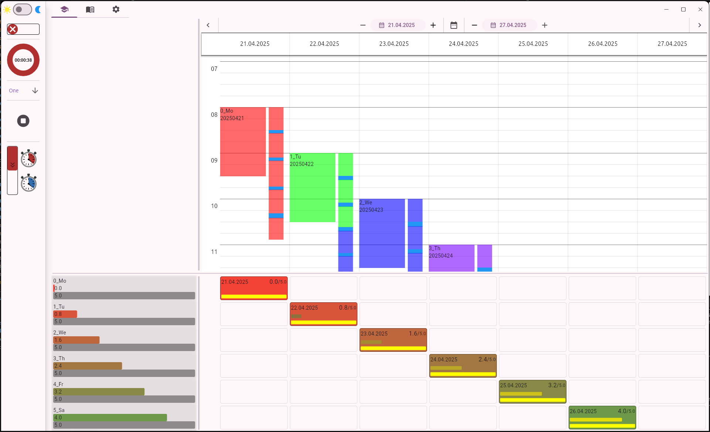

# Plantracker

This is the successor of https://github.com/Dude19735/python_scheduler built awesomely with Flutter and not finished yet.

The following image is a screenshot of the current functional prototype.

   
   <figcaption></figcaption>
    

